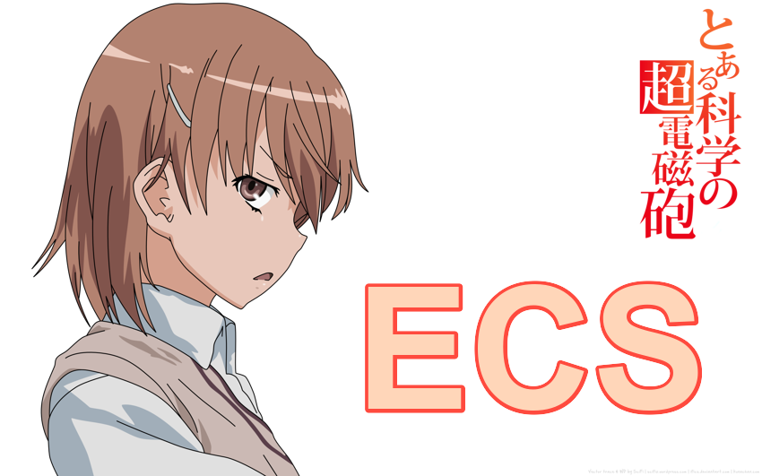

# Misaka ECS (Entity Component System) 

Simple C++ Entity Component System. Required C++17 or higher. Inspired by LibGDX Ashley ECS.

## Example
Creating components.
~~~.cpp
struct PlayerComponent : public IComponent
{
    ...
};
~~~

Adding components to Entity.
~~~.cpp
std::shared_ptr<PlayerComponent> component = std::make_shared<PlayerComponent>(...);
std::shared_ptr<Entity> entity = std::make_shared<Entity>();
entity->AddComponent<PlayerComponent>(playerComponent);
...
~~~

Creating systems.
~~~.cpp
struct PlayerSystem : public ISystem
{
    virtual void Update(float delta) override
    {
        ...
    }
    ...
};
~~~

Adding systems to Engine.
~~~.cpp
std::shared_ptr<PlayerSystem> system = std::make_shared<PlayerSystem>(...);
std::shared_ptr<Engine> engine = std::make_shared<Engine>();
engine->AddSystem<PlayerComponent>(playerComponent);
...
while(true)
{
    engine->Update(deltaTime);
}
...
~~~
